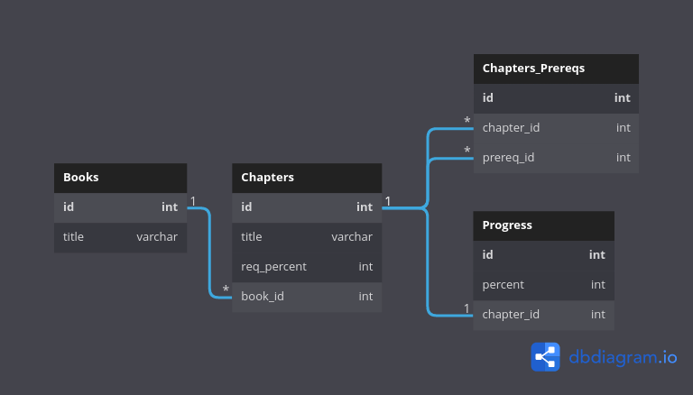

# Book study tracking program

Built with Python and SQLite SQL database engine.

## Description

In this program, each book contains several chapters.
Each chapter has one percent required to complete.

If the reading percentage of the chapter is greater than or equal to
this percentage, it means that the chapter has been completed.

Each chapter can also depend on one or more other chapters.
In this case, to study a chapter, you must complete the required chapters.

According to the above description,
the following commands were implemented in the program:

1. Adding a new chapter:
   `add_chapter book_name chapter_name required_percent`
1. Adding prerequisite chapter:
   `add_prerequisite_chapter book_name chapter_name prerequisite_chapter_name`
2. Deleting prerequisite chapter:
   `remove_prerequisite_chapter book_name chapter_name prerequisite_chapter_name`
3. Reading a chapter:
   `read book_name chapter_name percent`
4. Getting a reading status of a book:
   `stats book_name`

   This command prints the number of chapters read and the total
   number of chapters in a book in the following format:

   `completed_chapters_count of all_chapters_count`

5. Exit the application:
   `end`

## Demo

Running following commands:

```shell
add_chapter DesignPatterns Intro 100
read NotAvailable Intro 100
read DesignPatterns NotAvailable 100
stats DesignPatterns
add_chapter DesignPatterns CreationalDesignPatterns 80
add_prerequisite_chapter DesignPatterns CreationalDesignPatterns Intro
read DesignPatterns CreationalDesignPatterns 85
stats DesignPatterns
read DesignPatterns Intro 99
stats DesignPatterns
read DesignPatterns Intro 100
stats DesignPatterns
read DesignPatterns CreationalDesignPatterns 85
stats DesignPatterns
end
```

will produce the expected output:

```shell
0 of 1
0 of 2
0 of 2
1 of 2
2 of 2
```

## Database schema



> Note: pre_req_id is the id of the prerequisite chapter.

## License

Licensed under the MIT License. See the [LICENSE](LICENSE) file for more information.
